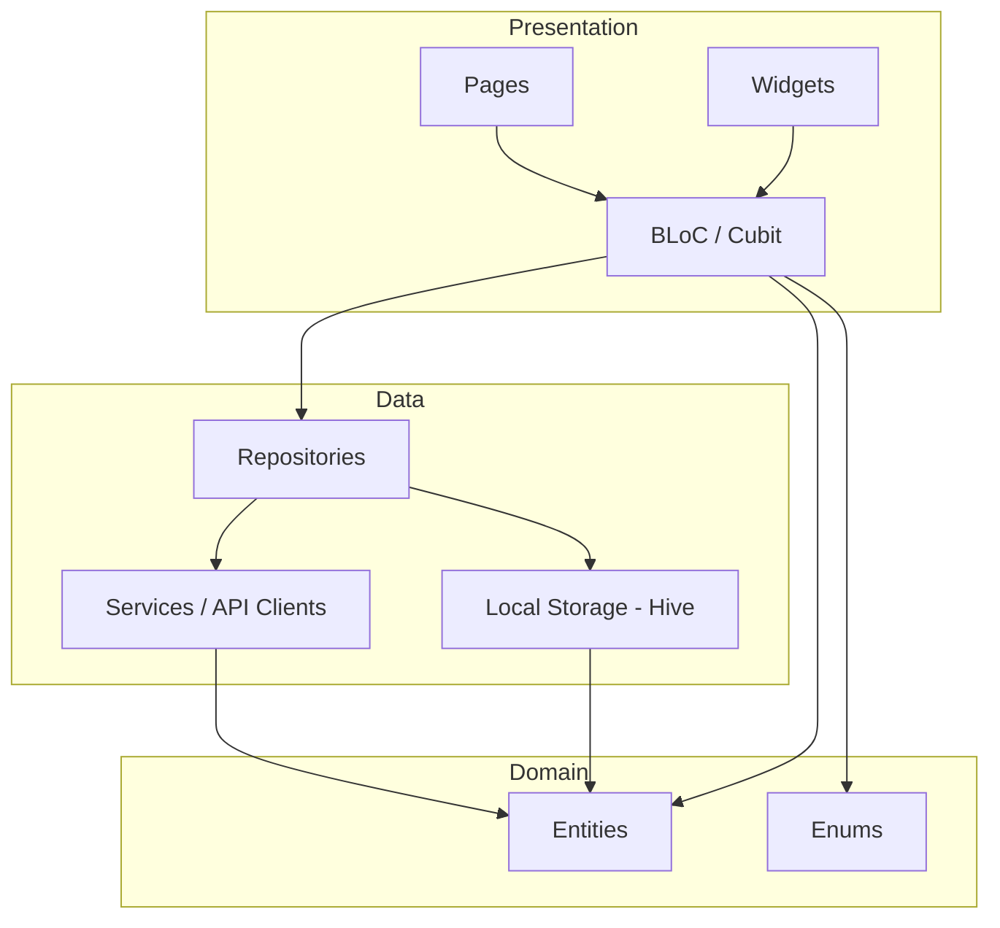
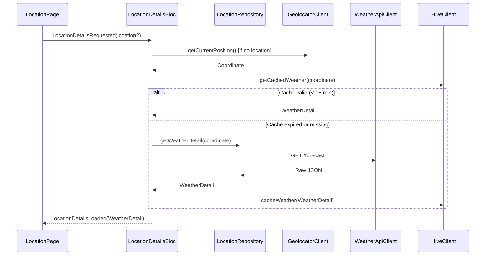
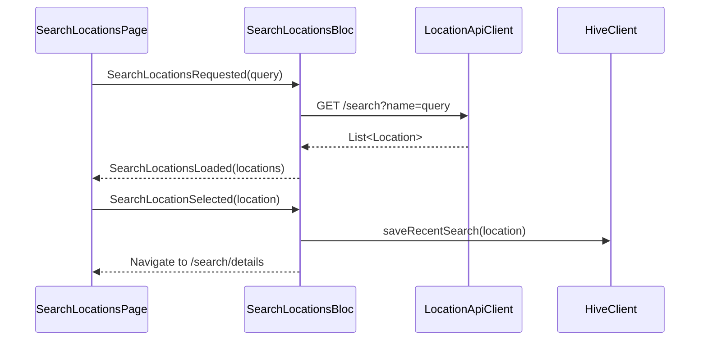
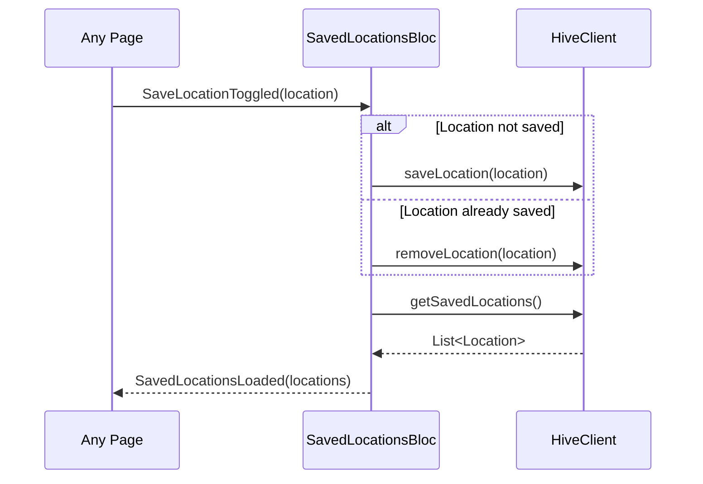
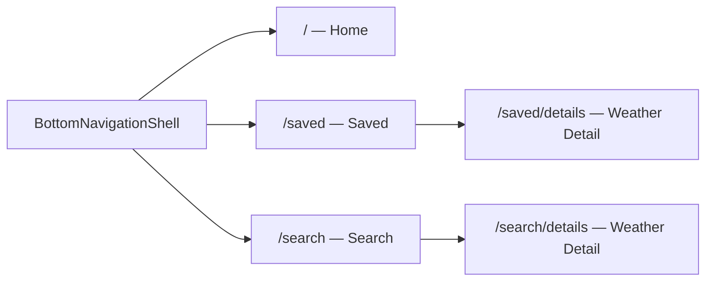
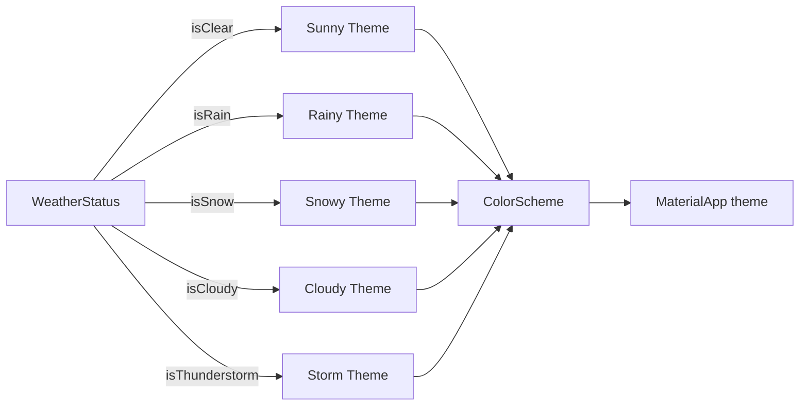

# Open Meteo App

A Flutter weather application built with clean architecture, BLoC state management, and the free [Open-Meteo API](https://open-meteo.com). It displays current conditions, hourly and 10-day forecasts, and adapts its theme dynamically based on weather conditions.

| Home | Saved Locations | Search Locations |
| -- | -- | -- |
|  |  |  |


---

## Table of Contents

- [Tech Stack](#tech-stack)
- [Architecture](#architecture)
- [Project Structure](#project-structure)
- [Modules](#modules)
- [Data Flow](#data-flow)
- [Navigation](#navigation)
- [Local Storage & Caching](#local-storage--caching)
- [Dynamic Theming](#dynamic-theming)
- [API Integration](#api-integration)
- [Getting Started](#getting-started)

---

## Tech Stack

| Layer | Technology |
|---|---|
| Framework | Flutter (Dart ^3.11.0) |
| State Management | [flutter_bloc](https://pub.dev/packages/flutter_bloc) ^9.1.1 |
| Navigation | [go_router](https://pub.dev/packages/go_router) ^17.1.0 |
| HTTP Client | [dio](https://pub.dev/packages/dio) ^5.9.1 |
| Local Storage | [hive_flutter](https://pub.dev/packages/hive_flutter) ^1.1.0 |
| Geolocation | [geolocator](https://pub.dev/packages/geolocator) ^14.0.2 |
| Icons | [lucide_icons_flutter](https://pub.dev/packages/lucide_icons_flutter) ^3.1.9 |
| Fonts | [google_fonts](https://pub.dev/packages/google_fonts) ^8.0.2 |
| Equality | [equatable](https://pub.dev/packages/equatable) ^2.0.8 |
| Formatting | [intl](https://pub.dev/packages/intl) ^0.20.2 |

---

## Architecture

The app follows **MVVM** with three distinct layers and the **BLoC pattern** for state management.



### State Management

Each feature module owns its BLoC. Global state is handled by Cubits at the app level.

| BLoC / Cubit | Responsibility |
|---|---|
| `LocationDetailsBloc` | Fetches and exposes weather data for a given location |
| `SavedLocationsBloc` | Manages the list of saved/favorite locations |
| `SearchLocationsBloc` | Handles location search queries and recent searches |
| `BottomNavigationCubit` | Tracks the active bottom navigation tab |
| `OpenMeteoThemeCubit` | Derives and exposes the app color theme from weather status |

---

## Project Structure

```
lib/
├── core/
│   ├── controllers/cubit/     # Global cubits (theme)
│   ├── entities/              # Shared data models (Location, WeatherDetail, etc.)
│   ├── enums/                 # WeatherStatus enum (WMO code mapping)
│   ├── route/                 # Go Router configuration
│   ├── services/              # API clients and Hive client
│   ├── shared/widgets/        # Reusable UI components
│   ├── theme/                 # Colors and typography
│   └── utils/                 # Helper functions
├── modules/
│   ├── bottom_navigation/     # Navigation shell page
│   ├── location/              # Home tab — current location weather
│   ├── saved/                 # Saved tab — favorite locations
│   └── search/                # Search tab — location search
└── main.dart
```

---

## Modules

### `location`

Displays full weather information for the user's current GPS location.

- Current temperature, weather status and description
- Hourly forecast (next 24 hours, horizontal scroll)
- 10-day daily forecast with min/max temperature range bar
- Detail cards: humidity, wind speed, UV index, visibility, precipitation probability, surface pressure

### `saved`

Manages saved (favorite) locations.

- Lists saved locations with a weather summary card each
- Allows toggling save/unsave
- Navigates to full weather detail for any saved location

### `search`

Location search and discovery.

- Search any city worldwide via the Geocoding API
- Displays weather preview for each result
- Maintains recent searches history (persisted in Hive)
- Save/unsave locations directly from search results

---

## Data Flow

### Fetching Weather for a Location



### Search Flow



### Save / Unsave Location



---

## Navigation

Navigation is handled by **Go Router** with type-safe routes via `TypedGoRoute`. Three persistent branches are mounted under a `StatefulShellRoute` (bottom navigation shell).



Routes pass `Location` objects as **extra parameters** to avoid encoding complex data in the URL path.

---

## Local Storage & Caching

Hive is used for three independent boxes:

| Box | Key | Value | Purpose |
|---|---|---|---|
| `saved_locations` | location id | `Location` JSON | Persisted favorites |
| `recent_searches` | location id | `Location` JSON | Recent search history |
| `cached_weather_locations` | coordinate string | `{data, timestamp}` JSON | Weather cache |

**Cache policy:** Cached weather entries are considered stale after **15 minutes**. On each request, `HiveClient` checks the timestamp before returning cached data; stale entries trigger a fresh API call.

---

## Dynamic Theming

The `OpenMeteoThemeCubit` derives a `ColorScheme` from the current `WeatherStatus`. This makes the entire app palette respond to weather conditions.



`WeatherStatus` is a Dart enum that maps all **WMO weather interpretation codes** (0–99) and exposes boolean getters (`isClear`, `isRain`, `isSnow`, `isThunderstorm`, etc.) along with icon, label, and description properties.

---

## API Integration

### Open-Meteo Geocoding API

```
Base URL: https://geocoding-api.open-meteo.com/v1
```

| Endpoint | Usage |
|---|---|
| `GET /search?name=<query>` | Search locations by name |

### Open-Meteo Weather API

```
Base URL: https://api.open-meteo.com/v1
```

| Endpoint | Usage |
|---|---|
| `GET /forecast?latitude=<latitude>&longitude=<longitude>` | Fetch weather data for a coordinate |

**Key forecast parameters requested:**

- `current`: temperature_2m, weather_code
- `hourly`: temperature_2m, precipitation_probability, weather_code
- `daily`: weather_code, temperature_2m_max, temperature_2m_min, precipitation_probability_max, uv_index_max
- `current` extras: relative_humidity_2m, wind_speed_10m, surface_pressure, visibility

Both APIs are free and require no authentication for non-comercial usage.

---

## Getting Started

### Prerequisites

- Flutter SDK (stable channel)
- Dart ^3.11.0

### Installation

```bash
git clone https://github.com/<your-username>/open_meteo_app.git
cd open_meteo_app
flutter pub get
```

### Run

```bash
flutter run
```
